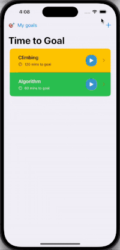
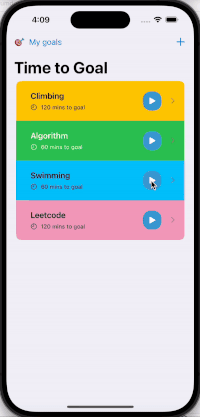
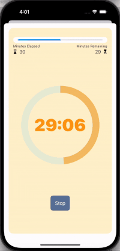
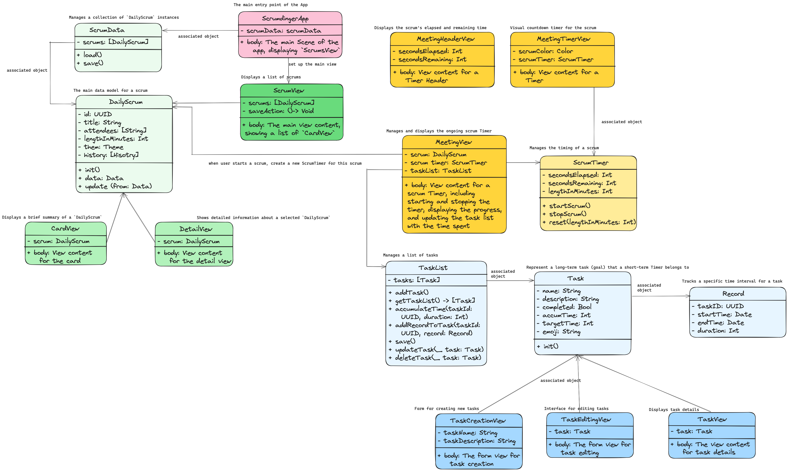

# TimeToGoal 🕒🏆

Start your 1000-hour journey today! ✨

Designed to shift focus from daily tasks to long-term achievements, TimeToGoal combines short-term task planning and long-term goal progress tracking to ensure you stay dedicated to your goals.

---

## 🎉 Award

**Winner of the Best Beginner Hack @FemmeHack 2024** 🏅

## ✨ Key Features

- **Make Plans with TODO List**: Add TODOs to your list.
- **Focus Timer**: Use the built-in timer to stay focused on your tasks.
- **Set Long-Term Goals & Monitor Progress**: Define significant goals, like mastering a skill with a 1000-hour investment. View accumulated time and progress towards each goal.

## 🎥 Demo

**Forward Planning: Add TODOs to Your List**

**Ongoing: Start Working with a Focus Timer**

**Backward Tracking: Track Your Progress with Long-term Goal**

_End the timer when you finish with your task and check how it contributes to your long-term goal._

## 🛠️ Project Structure

The project consists of three main parts, each color-coded for clarity:

1. **DailyScrum**: Short-term to-dos that users can add to their lists (Green).
2. **Timer**: The focus timer associated with each to-do item, created each time a user starts working on a to-do item (Yellow).
3. **Task**: Long-term goals with accumulated time (Blue).

In the diagram below:
- **Deep colors** represent views, which are the user interface components.
- **Shallow colors** represent associated objects, which handle the data and logic.

Detailed annotations of each class and their relationships can be found in the diagram.

## 📘 Story

TimeToGoal was created to address a gap in the market: existing time-management tools often induce stress rather than alleviate it. Most focus on short-term achievements, which can overwhelm users. 

Our vision was to develop a tool that promotes long-term dedication towards goals, making the process more manageable and less stressful, especially for those who struggle with ADHD. TimeToGoal shifts the focus from daily tasks to achieving long-term goals.

We embarked on this project with no prior mobile app development experience, learning Swift and Xcode from scratch in a single day. Our development process was a rapid educational journey, involving everything from setting up our project on GitHub to mastering the nuances of app design, such as creating and linking Views and managing data flow seamlessly within the app.

We finally won the Best Beginner Prize @FemmeHack 2024. Cheer for the girls! 🎉

## 🌟 Contributors

Meet our team of 4 dedicated women developers! 👧
- 👩‍💻 **Zairui Yang:** [@zairuiy-coding](https://github.com/zairuiy-coding)
- 👩‍💻 **Hao Tan:** [@tanhaow](https://github.com/tanhaow)
- 👩‍💻 **Huiyu Chen:** [@nolliechyTW](https://github.com/nolliechyTW)
- 👩‍💻 **Tong Hu:** [@TongHuoAo](https://github.com/TongHuoAo)

## 🚀 How to Run

1. **Clone This Repository**
2. **Open in Xcode**
3. **Build and Run the Project** on a simulator or a physical device

## ✨ Contribute

We welcome contributions from the community! Whether improving the algorithm, enhancing the UI, or expanding the dataset, your input can significantly enhance TimeToGoal.

---

Thank you for choosing TimeToGoal to help you achieve your long-term goals. Stay dedicated, and may you reach all your aspirations! 💪
